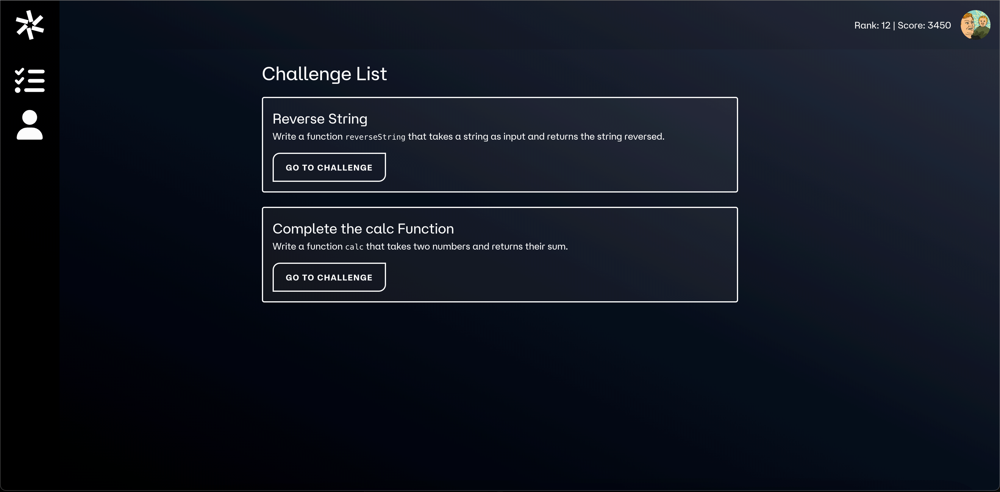

# Tribus LMS Frontend



## Overview

Tribus LMS is a Learning Management System built with a VueJS frontend and a WordPress headless backend. It enables users to complete coding challenges in a live coding environment similar to platforms like Codewars. The system evaluates code submissions using test cases stored on the backend and executed via Judge0.

## Tech Stack
- **Frontend**: VueJS with CodeMirror for the live coding environment.
- **Backend**: WordPress with custom post types (challenges) and REST API endpoints.
- **Code Execution**: Judge0 API, with Docker-based local execution for code submissions.
- **Authentication & Progress Tracking**: User accounts and progress are managed via WordPress.

## Features
1. **Challenge Pages**:
    - Each challenge is fetched from the WordPress backend.
    - The challenge includes a description and test cases for evaluation.

2. **Live Coding Environment**:
    - Users can write and execute code directly in the browser using CodeMirror.
    - Supported languages: PHP, JavaScript, Python (can be expanded).

3. **Code Submission and Evaluation**:
    - Code submissions are sent to Judge0 (or a Dockerized execution environment) to run against predefined test cases.
    - Results (pass/fail) are returned to the frontend, along with feedback.

4. **User Profile and Progress Tracking**:
    - Users can view their progress, rank, and scores.
    - Authentication is handled by WordPress's user management system.

## Example Workflow

1. **Fetch Challenge**: A user visits the challenge page, where the frontend fetches the challenge data from the WordPress backend via the REST API.
2. **Submit Code**: The user writes code and submits it to the backend.
3. **Run Tests**: The code is executed against predefined test cases.
4. **Get Feedback**: Results are returned to the frontend, indicating whether the solution passed or failed.

## How to Get Setup

### Prerequisites
Ensure you have the following tools installed:
- Node.js (>= 16.x.x)
- pnpm (or your preferred package manager, e.g., npm or Yarn)

### Installation

1. **Clone the repository**:
   ```bash
   git clone https://github.com/ShaneMuir/tribus-lms-frontend.git
   cd tribus-lms-frontend
   ```
2. **Install dependencies: Using pnpm:**
    ```bash
   pnpm install
   ```
    Alternatively, you can use npm or Yarn:
    ```bash
   npm install
    ```
   or
    ```bash
   yarn install
   ```
3. **Run the development server:**
   ```bash
   pnpm run dev
    ```

## How to Contribute

Contributions to Tribus LMS are welcome! To contribute:

1. **Fork the Repository**: Go to the [GitHub repo](https://github.com/ShaneMuir/tribus-lms-frontend) and click on "Fork" to create a copy of the repository in your GitHub account.
2. **Create a New Branch**:
    - For new features, create a branch with the name `feature/your-feature-name`.
    - For bug fixes, create a branch with the name `bug/your-bug-fix-name`.
3. **Make Your Changes**: Implement your feature or bug fix.
4. **Open a Pull Request (PR)**: Once your changes are ready, open a PR from your branch to the main repository. Be sure to include a clear description of the changes you've made.
5. **Review Process**: The PR will be reviewed, and any feedback or necessary changes will be discussed.

## Tools to Use

- **Frontend**: VueJS, CodeMirror
- **Backend**: WordPress (Custom Post Types, REST API)
- **Code Execution**: Judge0 API or Docker environment
- **Security**: Code is executed in an isolated environment to ensure security and performance.
